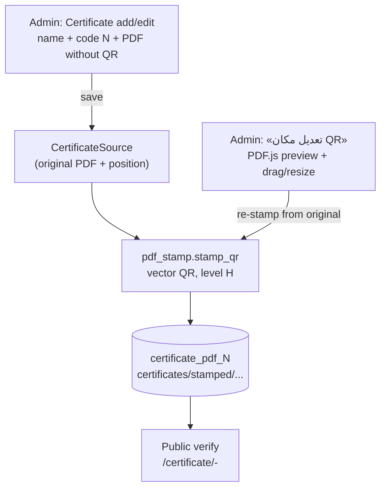

# Certificate QR Workflow

Staff-only, inside the Certificate admin. The server generates the QR for
each code and stamps it onto the certificate PDF; staff choose where it
goes. No external merging step. Design and decisions:
`CERTIFICATE_QR_STAMPING_PLAN.md`.

## System map

## Happy path

1. **Certificates → Add**: student name.
2. For each certificate: type the code (letters/digits only, e.g. `FA0082`)
   and upload the design **without a QR** in **«ملف الشهادة N (PDF)»**.
   (Tick «الملف يحتوي على QR بالفعل» only for a PDF that already has a QR.)
3. Save → the QR is stamped at the default position; the public PDF is
   ready.
4. Optional: green button **«📍 إضافة / تعديل مكان QR»** in the
   certificate section → drag/resize the green square → «تطبيق».
   The same button on a PDF saved without the system QR adds the QR on
   first «تطبيق» (that file is then treated as the design).
   Tick «اجعل هذا الموضع الافتراضي» once to use that position for every
   new certificate.
5. Scan test: phone camera → verification page + PDF.

## Rules

| Situation | Behaviour |
|---|---|
| Code without any PDF | Rejected |
| Code or student name changed | Slot re-stamped automatically (URL contains both) |
| New original uploaded | Replaces the old original, keeps the custom position |
| Upload with «الملف يحتوي على QR بالفعل» | Stored as-is, no QR added (original removed) |
| Code cleared | Original and stamped PDF removed |
| Same code anywhere in another certificate (any slot, any case) | Rejected |
| Code with `-`, spaces, symbols | Rejected (verify view splits the URL on `-`) |
| Encrypted / broken PDF | Form error |

Legacy certificates (PDF with QR already inside) keep working unchanged
in manual mode.

## URL scheme (single source of truth: `qr_utils.py`)

* `CERTIFICATE_PUBLIC_BASE_URL` (env, default
  `https://www.futureacademey.com`) + `/certificate/<slug>-<code-lower>`,
  no trailing slash — the same format as the QR codes already printed.
  Never derived from the request host.
* Slug: `slugify(name)`; Arabic-only names fall back to `certificate`.
* The verify view uses only the code after the last `-`, so the name part
  is display-only.

## Storage

* Originals: `certificates/originals/<random>_<file>.pdf`
* Stamped: `certificates/stamped/<slug>_<CODE>_<random>.pdf` (new key per
  stamp; the previous stamped file is deleted).
* Manual uploads: `certificates/<random>_<file>.pdf`.
* Random prefixes are required: R2/S3 storage overwrites equal names.

## Fallback downloads

QR PNG per slot and a ZIP per certificate (links on the change form), plus
the changelist action «تحميل رموز QR».

## Deploy checklist

* [ ] `pip install -r requirements.txt` (`pypdf`, `reportlab` added)
* [ ] Set `CERTIFICATE_PUBLIC_BASE_URL=https://www.futureacademey.com`
* [ ] `python manage.py migrate` (migration `0004`: new table + settings
      columns; no SQL change to existing certificate rows)
* [ ] Set the default QR position once from the placement page
* [ ] Stamp one real certificate → print → scan with a phone
